<p align="center">
  
</p>

<p align="center">
  <a href="https://shahcodes.dev"><code>portfolio</code></a> &nbsp;·&nbsp;
  <a href="https://drive.google.com/file/d/1JuRU85oUYq18H_MdXWuy7cSG0YM4-Nut/view?usp=share_link"><code>resume.pdf</code></a> &nbsp;·&nbsp;
  <a href="https://linkedin.com/in/shahnawaz-hussain-00b7b8226/"><code>linkedin</code></a> &nbsp;·&nbsp;
  <a href="https://www.leetcode.com/shahnawazhussaink"><code>leetcode</code></a> &nbsp;·&nbsp;
  <a href="https://twitter.com/k_shahnawazhuss"><code>x</code></a> &nbsp;·&nbsp;
  <a href="https://instagram.com/shahnawaz.hussaink"><code>instagram</code></a> &nbsp;·&nbsp;
  <a href="mailto:shahnawaz.hussain96508@gmail.com"><code>email</code></a>
</p>

<br/>

> Most developers list their stack. I'd rather show you what happens to a request when it hits it.

<br/>

## `GET /v1/stack`

<p align="center">
  
</p>

<p align="center"><sub>green hits Redis and returns fast · amber goes to the database · red gets rate-limited — every box is something I build with</sub></p>

<br/>

## `GET /v1/experience`

```yaml
- company: SamarthX
  role: Intern
```

<!--
  Make this section hit hard — add these keys inside the yaml block above:

  period: Jun 2026 – present
  shipped:
    - REST APIs in Node.js/Express used by <N> users
    - Redis caching that cut response time by <X>%
    - JWT auth + rate limiting across <N> endpoints

  Numbers > adjectives. Recruiters skim for them.
-->

<br/>

## `GET /v1/changelog`

```diff
+ added       Go — goroutines are my new love language
+ added       Angular — to understand the people calling my APIs
+ joined      SamarthX as an Intern
+ learned     JWT auth, rate limiting, Redis caching, WebSockets
- removed     fear of production deploys
- deprecated  console.log debugging (mostly)

@@ in progress @@
  industry-level backend engineering
  system design: caching, scaling, failure modes
  Go concurrency patterns
```

<br/>

## `tail -f /var/log/shahnawaz.log`

```console
[INFO]  reading Express source code to see how routing actually works
[INFO]  talked to AI more than to humans today. again.
[WARN]  "it works on my machine" detected — investigating
[DEBUG] chai level: sufficient for 1 more endpoint
[INFO]  open to backend roles & collaborations
```

<br/>

## `POST /v1/hire`

```bash
# no SDK, no auth token — just send it
open "mailto:shahnawaz.hussain96508@gmail.com?subject=Let's%20build%20something"
```

<br/>

<p align="center">
  <sub><code>429 Too Many Requests</code> — you've reached the end of this README.<br/>My inbox, however, has no rate limit.</sub>
</p>
